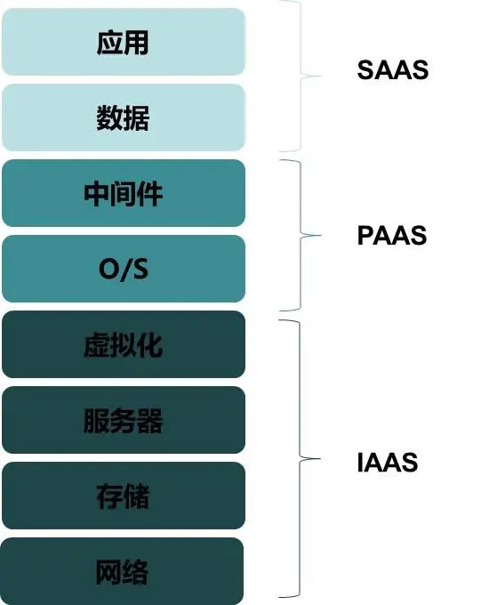
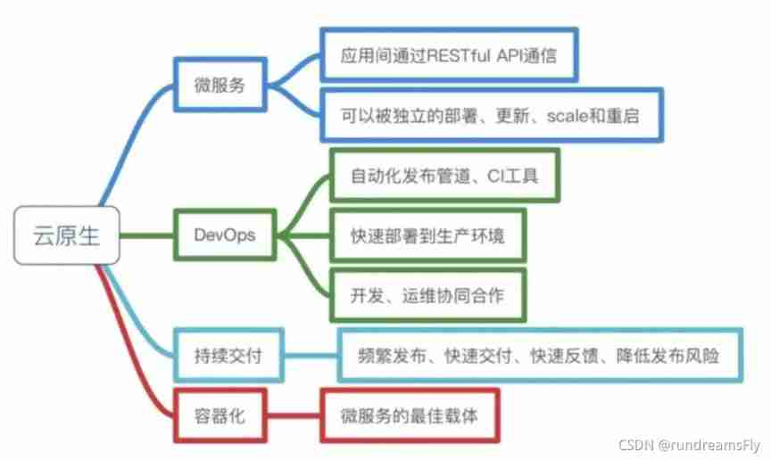

### 前言

作为“十三五”重点规划产业之一，云计算到底是什么？又会怎样发展？
最近兴起的云原生（Cloud Native）和无服务器架构（Serverless）又与云计算有什么关系

### 服务器发展史

纵观整个服务器的发展历程，可以分为三阶段，自建服务器时代、服务器托管与租赁时代、云计算时代

### 云计算

##### 云计算的定义

简单来说就是按需付费，支持按时、按 CPU 核、按内存、按带宽、按硬盘大小来付费。
云计算发展到今天，有着更细化的市场，如阿里就将服务分为弹性计算（IaaS），存储服务（PaaS），数据库（PaaS）等，每种设施还有更加细致的分类，如弹性计算中的 ECS，就可以分为通用型、计算型、内存型等，用于满足不同企业需求

云计算是指一种网络计算模式，给大家随时随地提供解决网络资源的一种计算服务和应用

##### 背后原理

云计算的云资源还是借助于物理服务器，以kvm虚拟化技术或者其他虚拟化技术将物理服务器的资源进行虚拟化，超卖，达到更大的资源利用，这也是云厂商盈利的手段之一吧，以廉价的云资源吸引用户购买，毕竟不是人人都用得上物理服务器的

##### 云计算的发展

云计算由美国国家标准和技术研究院（National Institute of Standards and Technology）定义了三种模型，对应三种服务级别：基础设施即服务（IaaS）、平台即服务（PaaS）和软件即服务（SaaS）

1. Infrastructure-as-a-Service（基础设施即服务）提供给消费者的服务是对所有计算基础设施的利用，包括处理CPU、内存、存储、网络和其它基本的计算资源，用户能够部署和运行任意软件，包括操作系统和应用程序。如亚马逊的EC2、阿里的ECS

2. Platform-as-a-Service（平台即服务）提供给消费者的服务是把客户采用提供的开发语言和工具（例如Java，python，.Net等）开发的或收购的应用程序部署到供应商的云计算基础设施上去。如阿里的云数据库系列

3. Software-as-a-Service（软件即服务）提供给客户的服务是运营商运行在云计算基础设施上的应用程序，用户可以在各种设备上通过客户端界面访问，如浏览器。消费者不需要管理或控制任何云计算基础设施，包括网络、服务器、操作系统、存储等等。广义上来讲，所有的互联网产品都可以是 SaaS，如钉钉、163 邮箱，都可以被称为 SaaS。

   

**简单描述**

同事入职新公司，没有云的一天：拿到公司分配的设备，进行系统的安装，环境的安装，软件的安装，进行工作和开发

同事入职新公司，有云服务的一天：分配一个瘦客户端/云桌面，登录云的账号密码，就有了一个操作系统，操作系统是安装在云端的，统一进行管理的，这样可以保持一个公司开发环境或者是操作系统的统一性，这个就是IAAS。系统问题解决之后，同事需要安装一个开发工具vscode进行开发工作，这时候把这些软件都放到云端进行管理，只要登录账户就能拥有统一的工作软件，这就是SAAS。每个工种所需要的环境都不相同，比如新同事是前端开发，需要前端的环境，为了让所有前端/后端的环境是一样的，把工作环境把升级到云端管理，这种叫PAAS平台服务。

云计算按照部署版本可以分为私有云、公有云、混合云。
私有云为企业私有，并不对外服务；公有云并不代表免费，而是对外提供使用（收费）；混合云则同时拥有二者特性

相信到这里已经了解什么是云计算，简单来说就是对外服务器租用，
早期的服务器租用在员外看来也可以称之为云计算（IaaS），对比今天的云产品本质上没有区别，只是在资源上更加细化，服务上更加完善而已

### 云原生与Serverless

如今大规模普及的 PaaS 已经提供了绝大多数的服务，SaaS 并不适合通用场景，云计算若想再进一步只能从两个方向入手：

- 方案一：继续开发通用的 SaaS 平台
- 方案二：尝试从 PaaS 上入手

方案一没有可行性，云提供商不可能开发市面上所有的业务系统，并且云厂商也没有精力做。我们从方案二入手，根据上图我们可以得出结论：PaaS 与 SaaS 区别在于是否管理应用，两者之间是否有折中的方案？
进一步考虑，云计算实际上是减少了服务器与运维成本，而 IT 企业更大的成本在于编码（研发成本），能否有一种方案能够简化编码从而降低企业成本呢？运维成本还可以再降吗？云厂商自然不会停滞不前：

- 降低运维成本，现在阶段云厂商提供的服务还需要运维人员来管理服务器数量、内存大小、CPU核心数、所在区域等，无服务器（Serverless）架构就致力于解决以上问题，在无服务器模式下，运维人员只需要关心部署即可。具体产品有AWS Lambda、Google Cloud Functions、IBM Cloud Functions、Azure Functions等，但目前的无服务器（Serverless）架构大多需要针对编程，还不是很完善。
- 降低开发成本则提出了云原生（Cloud Native）的概念，云原生致力于简化整个开发生态，从开发到运维甚至云计算厂商，目前云原生主要依赖微服务、容器化技术、容器编排（Kubernetes）来实现。

### 云原生

##### 定义

云原生是一种充分利用云计算优势，用于构建和部署应用的方式；
总结来说，云原生就是一个快速构建应用的理念，一种快速交付应用的技术集合

##### 云原生代表的技术

上文提到过云原生是一种理念，一个技术栈的集合。
那么相对应的技术栈主要有：容器、服务网格、微服务、不可变基础设施和声明式API

容器：docker容器化技术，Kubernetes容器编排技术

DevOps：jenkins，rancher。。。

服务网格：比如Service Mesh等

微服务技术：SpringBoot，SpringCloud，SpringCloudAlibaba，Dubbo。。。

这些技术能够构建容错性好、易于管理和便于观察的松耦合系统。结合可靠的自动化手段，云原生技术使工程师能够轻松地对系统作出频繁和可预测的重大变更

##### 云原生应用的构造步骤

1. 立项思维：核心为Devops，在构建应用之前，改变以往运维、开发分立的局面，促进运维和开发高效协同工作。
2. 应用开发：核心为微服务，根据业务需求将整体业务设计为松耦合的服务，以API驱动，满足12要素
3. 基础设施：核心为容器，通过容器去构建不可变基础设施，通过以旧换新，解决环境差异、大规模运维等问题。
4. 持续交付：核心为CI/CD，即持续集成、持续部署与持续发布，便于应用的构建、测试和发布变得快捷。

### serverless

##### 定义

Serverless 圈内俗称为“无服务器架构”，Serverless 不是具体的一个编程框架、类库或者工具。
简单来说，Serverless 是一种软件系统架构思想和方法，它的核心思想是用户无须关注支撑应用服务运行的底层主机。
这种架构的思想和方法将对未来软件应用的设计、开发和运营产生深远的影响

##### 发展背景

传统的云计算技术，本质上都是基于虚拟机的，云平台可以将一些性能强劲的物理服务器，拆分成若干个虚拟机，提供给用户使用，但在互联网发展到今天，虚拟机还是太重了。即使是飞天集群，新增部署虚拟机的时间也是以分钟来计的。但是对于互联网用户来讲20秒的等等就是就会千万50%以上的用户流失，不能忍受的煎熬，因此**Docker秒级启动的速度也不是个完美的解决方案，最终还是要Serverless极速的伸缩才能满足客户需求。**

**以docker为代表的容器技术仅仅是缩短了应用程序的迭代周期，而serverless技术是直接缩短了创新周期**，从概念到最小可行性部署的时间，让初级开发人员也能在很短的时间内完成以前通常要经验丰富的工程师才能完成的项目。

通俗的讲，Serverless就是基建狂魔版的云平台，虽然传统的基建技术安全性更高，稳定性也更好，但是从头修路、盖房、装修成本太高时间也太长，而Serverless本质上是一个比容器还小的最小运行环境的镜像，只要给点阳光就能灿烂，而且用完以后想拆也很方便，是应对云原生时代最新发展出的神器。

Serverless的核心理念就是函数式计算，开发者无需再关注具体的模块，**云上部署的粒度变成了程序函数，自动伸缩、扩容等工作完全由云服务负责。**

##### Serverless 架构的组成

Serverless架构分为 Backend as a Service(BaaS) 和 Functions as a Service(FaaS) 两种技术，
Serverless 它是由开发者实现的服务端逻辑运行在无状态的计算容器中，它是由事件触发，完全被第三方管理的

Serverless的应用架构是将 BaaS 和 FaaS 组合在一起的应用，用户只需要关注应用的业务逻辑代码，编写函数为粒度将其运行在FaaS平台上，并且和BaaS第三方服务整合在一起，最后就搭建了一个完整的系统。整个系统过程中完全无需关注服务器。

>什么是 BaaS

Baas 的英文翻译成中文的含义：后端即服务，它的应用架构由大量第三方云服务器和API组成的，使应用中关于服务器的逻辑和状态都由服务提供方来管理的。比如我们的典型的单页应用SPA和移动APP富客户端应用，前后端交互主要是以RestAPI调用为主。只需要调用服务提供方的API即可完成相应的功能，比如常见的身份验证，云端数据/文件存储，消息推送，应用数据分析等

>什么是 FaaS

FaaS可以被叫做：函数即服务。开发者可以直接将服务业务逻辑代码部署，运行在第三方提供的无状态计算容器中，开发者只需要编写业务代码即可，无需关注服务器，并且代码的执行它是由事件触发的。其中AWS Lambda是目前最佳的FaaS实现之一