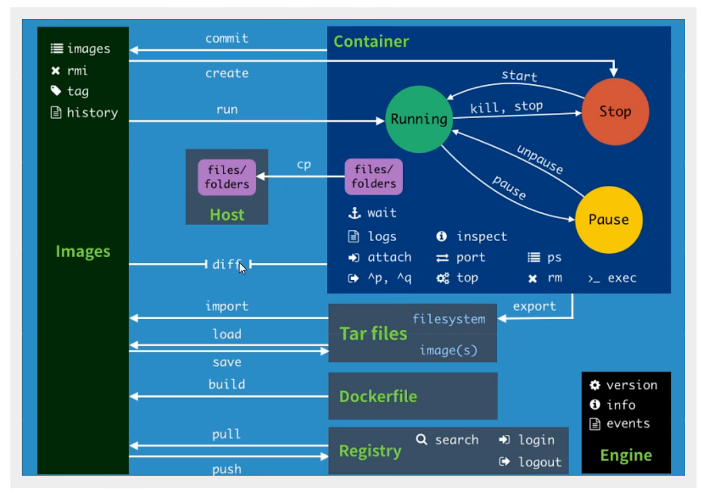
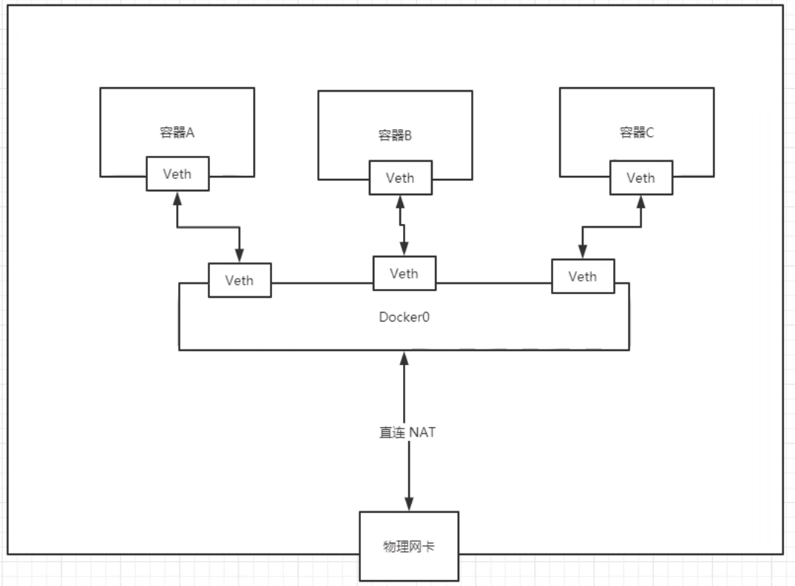

### docker的安装

##### docker的基本组成

1. 镜像：Docker镜像就好比是一个模板，可以通过这个模板来创建容器服务，tomcat镜像 ===> run ===> tomcat01容器， 通过这个镜像可以创建多个容器（最终服务运行或者项目运行就是在容器中的）

2. 容器：Docker利用容器技术，独立运行一个或者一组应用， 通过镜像来创建的；就目前可以把这个容器理解为一个简易的linux系统

3. 仓库：存放镜像的地方；Docker Hub（默认是国外的）；阿里云,,,都有容器服务（配置镜像加速！）

##### 安装卸载

```bash
# 1 卸载旧的版本
yum remove docker docker-common docker-selinux docker-engine
# 2 需要安装的包
yum install -y yum-utils
# 3 设置镜像的仓库
yum-config-manager --add-repo http://download.docker.com/linux/centos/docker-ce.repo
yum-config-manager --add-repo http://mirrors.aliyun.com/docker-ce/linux/centos/docker-ce.repo
# 更新yum软件包索引
yum makecache fast
# 4 安装docker相关的版本  docker-ce 社区版  ee 企业版
yum -y install docker-ce docker-ce-cli containerd.io
# 5 启动docker
systemctl start docker
# 6 查看docker版本确认是否安装成功
docker version
# 7 下载hello word-docker镜像
docker run hello-world
# 8 查看hello-world镜像
docker images
# 9 卸载docker（卸载依赖，删除资源）/var/lib/docker  docker的默认工作路径
yum remove docker-ce docker-ce-cli containerd.io
rm -rf /var/lib/docker
```

##### 阿里云镜像加速

1. 登录阿里云找到容器服务
2. 找到镜像加速地址（/镜像中心/镜像加速器）
3. 配置使用（复制镜像加速器页面下的命令）

### docker底层原理

**docker是怎么工作的**

docker是一个client-server结构的系统，docker的守护进程运行在主机上，通过socket从客户端访问
dockerServer接收到docker-client的指令，就会执行这个指令

**docker为什么比vm快**

1. docker有着比虚拟机更少的抽象层
2. docker利用的是宿主机的内核，vm需要的是guest OS

### docker的常用命令



##### 帮助命令

```bash
docker version    #显示docker版本信息
docker info       #docker系统信息，包括镜像和容器的数量
docker --help     #帮助命令

```

##### 镜像命令

docker images  查看所有本地主机上的镜像
-a参数：列出所有所有镜像的信息
-q参数：列出所有镜像的id

docker search 搜索镜像
--filter=STARS=3000: 搜索出来的镜像就是STARS大于3000的

docker pull  下载镜像

docker rmi 删除镜像
docker rmi -f  容器id
docker rmi -f $(docker images -aq): 递归删除，删除所有镜像


##### 容器命令

有了镜像才可以创建容器

```bash
docker pull centos  #下载一个centos镜像
```

新建容器并启动

```bash
docker run 【可选参数】image
#参数说明
--name='Name'  #容器名字
-d   #后台方式运行
-it #使用交互方式运行，进入容器查看内容
-p  #指定容器的端口 -p 8080

#测试，启动并进入容器
docker run -it centos /bin/bash
#查看容器内的centos,基础版本，很多命令都是不完善的
ls
#退出当前容器回到服务器
exit

```

列出所有运行中的容器

```bash
docker ps #列出当前正在运行的容器
参数：
-a   #列出当前正在运行的容器+历史运行过的容器
-n=?1 # 显示最近创建过的容器
-q   #只显示容器的编号
```

退出容器

```bash
exit # 直接容器停止并且退出
ctrl+p+q # 容器不停止退出
```

删除容器

```bash
docker rm + 容器id  #删除指定的额容器
docker rm -f $(docker ps -aq)  #删除所有容器
```

启动和停止容器的操作

```
docker start + 容器id
docker restart + 容器id
docker stop + 容器id  # 停止当前正在运行的容器
docker kill + 容器id  # 强制停止当前容器
```

##### 常用的其他命令

后台启动容器

```bash
docker run -d +镜像名
# 问题。发现镜像停止了
# 常见的坑 docker容器使用后台运行 就必须要有一个前台进程，docker发现没有应用，就会停止
```

查看日志

```bash
docker logs -f -t  
docker logs -tf --tail 10  +容器id
```

查看容器中的进程信息

```
docker top +容器id
```

查看镜像元数据

```
docker inspect +容器id
```

进入当前正在运行的容器

```bash
# 我们通常容器都是使用后台方式运行的 需要进入容器 修改一些配置
# 命令
#进入容器后开启一个新的终端，可以在里面操作（常用）
docker exec -it +容器id bin/bash
# 进入容器正在执行的终端，不会开启新的进程
docker attach +容器id
```

从容器内拷贝文件到主机上

```
docker cp + 容器id:容器内路径 + 目的地的主机路径
```

### 环境部署

##### 部署nginx

```bash
# 搜索镜像（建议去dockerhub官网搜索，可以看到详细信息）
docker search nginx
# 拉取镜像
docker pull nginx
# 查看镜像
docker images
# 后台运行nginx镜像 -d 后台运行 --name 给容器取名字 -p 暴露端口（宿主机端口+容器内部端口）
docker run -d --name nginx01 -p 3344:80 nginx
#查看容器
docker ps
#测试运行
curl localhost:3344
# 进入容器
docker exec -it nginx01 /bin/bash
#询问目录
whereis nginx
```

**问题**

我们每次改动nginx配置文件，都需要进入容器内部，显得十分麻烦。我们要是在容器外部提供一个映射路径，达到在容器外修改文件，容器内就可以自动同步更新！

数据卷技术

##### 部署tomcat

```bash
#官方的使用
#之前的使用是后台开启，停止容器之后还能后台查到， docker run -it -rm一般用来测试，用完就自动删除
docker run -it -rm tomcat:9.0
#下载再启动
docker pull tomcat
#启动运行
docker run -d -p 3355:8080 --name tomcat01 tomcat
#测试访问 发现页面404
#问题： 1. 发现linux命令少了 2 没有webapps目录
#原因：阿里云镜像问题，默认是最小的镜像，所有不必要的都剔除

```

**问题**

我们以后要部署项目，如果每次都要进入容器会十分麻烦
如果可以在容器外部提供一个映射路径，webapps，我们在外部放置项目，就能同步到内部

##### 部署ES+Kibana

```bash
# es 暴露的端口多  十分的耗内存  es的数据一般需要放置到安全目录
# --net somenetwork 网络配置
#下载启动
docker run -d --name elasticsearch -p 9200:9300 -e "discovery.type=single-node" elasticsearch:7.6.2
#启动之后发现很卡，因为很耗内存 
#查看cpu状态
docker stats
#测试es是否成功了
curl localhost:9200
#关闭es，增加内存的限制
docker ps
docker stop +容器id
#增加内存限制  修改配置文件 -e 环境配置修改
docker run -d --name elasticsearch -p 9200:9300 -e "discovery.type=single-node" -e ES_JAVA_OPTS="Xms64m -Xmx512m" elasticsearch:7.6.2
#查看docker start
```

### 可视化

> portainer

图形化管理界面工具，提供一个后台面板供我们操作

```bash
docker run -d -p 8088:9000 \ --restart=always -v /var/run/docker.sock:/var/run/docker.sock --privileged=true portainer/portainer
```

访问测试：外网8088端口

> rancher

### docker镜像讲解

##### 镜像概述

镜像是一种轻量级、可执行的独立软件包，用来打包软件运行环境和基于运行环境开发的软件，它包含运行某个软件所需的所有内容，包括代码、运行时、库、环境变量和配置文件。
所有的应用，直接打包docker镜像，就可以直接跑起来！I

**如何得到镜像：**

1. 从远程仓库下载
2. 朋友拷贝给你
3. 自己制作一个镜像DockerFile

##### 镜像加载原理

> UnionFS（联合文件系统）

UnionFS（联合文件系统）：Union文件系统（UnionFS）是一种分层、轻量级并且高性能的文件系统，它支持对文件系统的修改作为一次提交来一层层的叠口，同时可以将不同目录挂载到同一个虚拟文件系统下（unite several directories into a single virtual filesystem）。Union文件系统是Docker镜像的基础。镜像可以通过分层来进行继承，基于基础镜像（没有父镜像），可以制作各种具体的应用镜像。
特性：一次同时加载多个文件系统，但从外面看起来，只能看到一个文件系统，联合加载会把各层文件系统叠加起来，这样最终的文件系统会包含所有底层的文件和目录

> Docker镜像加载原理

docker的镜像实际上由一层一层的文件系统组成，这种层级的文件系统UnionFS。
bootfs（boot file system）主要包含bootloader和kernel，bootloader主要是引导加载kernel，Linux刚启动时会加载bootfs文件系统，在Docker镜像的最底层是bootfs。这一层与我们典型的Linux/Unix系统是一样的，包含boot加载器和内核。当boot加载完成之后整个内核就都在内存中了，此时内存的使用权已由bootfs转交给内核，此时系统也会卸载bootfs。
rootfs（root file system），在bootfs之上。包含的就是典型Linux系统中的/dev，/proc，/bin，/etc等标准目录和文件。rootfs就是各种不同的操作系统发行版，比如Ubuntu，Centos等等。

##### 分层理解

> 分层的镜像

我们可以去下载一个镜像，观察下载的日志输出，可以看到是一层一层在下载

问题：为什么docker要采用分层的解构

答案：是资源共享！
			比如有多个镜像都从相同的Base镜像构建而来，那么宿主机只需在磁盘上保留一份base镜像，同时内存中也只需要加载一份base			镜像，这样就可以为所有的容器服务了，而且镜像的每一层都可以被共享。

查看镜像分层的方式可以通过docker image inspect命令！

> 特点

Docker镜像都是只读的，当容器启动时，一个新的可写层被加载到镜像的顶部！
这一层就是我们通常说的容器层，容器之下的都叫镜像层！

##### commit镜像

如何提交一个自己的镜像

```bash
docker commit 提交容器成为一个新的副本
#命令和git原理类似
docker commit -m="...."
```

实战测试

```
#启动一个默认的tomcat
#发现默认的tomcat是没有webapp应用的，镜像的原因，默认没有
#自己拷贝进去基本的文件
#将我们操作过的容器提交为一个新的镜像
```

### 容器数据卷

##### 概述

**docker的理念回顾**
将应用和环境打包成一个镜像！
数据？如果数据都在容器中，那么我们容器删除，数据就会丢失！
需求：数据可以持久化MySQL，容器删了，删库跑路！
需求：MySQL数据可以存储在本地！
容器之间可以有一个数据共享的技术！Docker容器中产生的数据，同步到本地！
这就是卷技术！目录的挂载，将我们容器内的目录，挂载到Linux上面！

总结一句话：容器的持久化和同步操作！容器间也是可以数据共享的！

##### 使用数据卷

> 方式一 使用命令的方式来挂载  -v

```bash
docker run -it -v 主机目录 容器内目录
#测试
docker run -it -v /home/ceshi:/home/ centos  /bin/bash
#启动起来的时候，我们可以通过 docker inspect +容器id
# 查看Mounts字段里面的信息，里面就是挂载的内容
#这时候在容器内部添加的数据，会自动同步到容器外部挂载的目录上。这是一个双向绑定的操作，在容器外部修改数据也会自动同步到容器内部
```

好处：我们以后修改只需要在本地修改即可，容器内部会自动同步！

> 实战  安装mysql

思考：mysql的数据持久化问题

```bash
#获取镜像
docker pull mysql:5.7
#运行容器，需要做数据挂载
#安装启动mysql 需要配置密码
#官方测试 docker run --name some-mysql -e MQSQL_ROOT_PASSWORD=my-secert-pw -d mysql:tag
#启动我们自己的
docker run -d -p 3310:3306 -v /home/mysql/conf:/etc/mysqlconf.d -v /home/mysql/data:/var/lib/mysql -e MQSQL_ROOT_PASSWORD=my-secert-pw --name mysql01 mysql:5.7
# -d 后台启动
# -p 端口映射
# -v 数据卷挂载
# -e 环境配置
# --name 容器名字

#启动成功后，在我们的本地sqlyog来链接测试一下
```

##### 具名挂载和匿名挂载

```bash
#匿名挂载
# -v 容器内路径
docker run -d -p --name nginx01 -v /etc/nginx nginx
#查看所有卷的情况
docker volume ls
#1oca1    9f38292179faa178afcce54d80be99d4ddd68c91d2a68870bcece72d2b7ed061
# 这里发现 这种就是匿名挂载 因为我们指定了容器内的路径，没有指定容器外的路径 


#具名挂载
docker run -d -p --namenginx02 -v juming-nginx:/etc/nginx nginx
docker volume ls 
#DRIVERVOLUME NAME
#1oca1juming-nginx
#通过-v 卷名：容器内路径

#所有docker容器内的卷，在没有指定目录的情况下，都是在/var/lib/docker/volumes/xxxx/_data
#我们可以通过具名挂载方便地找到一个卷，所以大多数情况下都是用的具名挂载

#如何确定是具名挂载还是匿名挂载，还是指定路径挂载！
-V容器内路径		#匿名挂载
-v卷名:容器内路径	#具名挂载
-V/宿主机路径::容器内路径	#指定路径挂载！
```

**拓展：**

```bash
#通过-v容器内路径：ro rw改变读写权限
ro readonly	#只读
rw readwrite	#可读可写
#一旦这个了设置了容器权限，容器对我们挂载出来的内容就有限定了！
docker run -d -p --name nginx02 -v juming-nginx:/etc/nginx:ro nginx
docker run -d -p --name nginx02 -v juming-nginx:/etc/nginx:rw nginx 
# ro 说明这个路径只能从宿主机操作，容器内部是不能操作的   
```

##### dockerFile 数据卷

dockerFile就是用来构建docker镜像的构建文件

```bash
#创建一个dockerfile文件，名字可以随机建议Dockerfile
#文件中的内容指令（大写）参数
FROM centos 
VOLUME["volume01"，"volume02"]
CMD echo"----end------"
CMD/bin/bash
#这里的每个命令，就是镜像的一层！
```


```bash
#启动自己写的容器
docker images
docker run -it +镜像名 /bin/bash 
```


##### 数据卷容器

两个或者多个容器之间的数据共享(volumes-from)

b容器挂载在a容器下，a容器就叫做数据卷容器

```bash
# 多个mysql容器实现数据共享
docker run -d -p 3310:3306 -v /etc/mysq1/conf.d-v/var/1ib/mysql -e MYSQL_ROOT_PASSWORD=123456 --name mysq101 mysql:5.7
docker run -d -p 3310:3306 -e MYSQL_ROOT_PASSWORD=123456 --name mysq102 --volumes-from mysq101 mysql:5.7
#这个时候，可以实现两个容器数据同步！
```

结论：容器之间配置信息的传递，数据卷容器的生命周期一直持续到没有容器使用为止
			但是一旦你持久化到了本地，这个时候，本地的数据是不会删除的！|


### dockerFile

dockerFile核心是用来构建docker镜像的文件！命令参数脚本
构建步骤：

1. 编写一个dockerfile文件
2. docker build构建成为一个镜像
3. docker run 运行镜像
4. docker push 发布镜像（DockerHub、阿里云镜像仓库！）

##### 构建过程

dockerfile是面向开发的，我们以后要发布项目，做镜像，就需要编写dockerfile文件，这个文件十分简单！
Docker镜像逐渐成为企业交付的标准，必须要掌握！
步骤：开发，部署，运维。。。缺一不可！
DockerFile：构建文件，定义了一切的步骤，源代码
Dockerlmages：通过DockerFile 构建生成的镜像，最终发布和运行的产品！
Docker容器：容器就是镜像运起来提供服务器

##### dockerfile指令

```bash
FROM		#基础镜镜像，一切从这里开始构建
MAINTAINER	#镜像是谁写的，姓名+邮箱
RUN			#镜像构建的时候需要运行的命令
ADD			#步骤：tomcat镜像，这个tomcat压缩包！添加内容WORKDIR#镜像的工作目录
VOLUME		#挂载的目录
EXPOSE		#保留端口配懂
CMD			#指定这个容器启动的时候要运行的命令，只有最后一个会生效，可被替代
ENTRYPOINT	#指定这个容器启动的时候要运行的命令，可以追加命令
ONBUILD		#当构建一个被继承DockerFile这个时候就会运行ONBUILD的指令。触发指令。
COPY		#类似ADD，将我们文件拷贝到镜像中
ENV			#构建的时候设置环境变量！
```

##### 实战:构建自己的centos

```bash
#1编写Dockerfile的文件
[root@kuangshen dockerfile]#cat mydockerfile-centos
FROM centos
MAINTAINER kuangshen<24736743@qq.com>
ENV MYPATH /usr/1ocal
WORKDIR $MYPATH
RUN yum-y install vim
RUN yum-y install net-tools
EXPOSE 80
CMD echo $MYPATH
CMD echo"----end----"
CMD/bin/bash
#2、通过这个文件构建镜像
#命令 docker build -f dockerfi1e文件路径 -t 镜像名:[tag]
successfully built e2bd75cfe070I
Successfully tagged mycentos：0.1
# 3 测试运行
#查看容器 启动容器
docker images
docker run -it +容器id
```

可以通过 docker history 命令查看镜像的构建过程

> CMD 和 ENTRYPOINT

```bash
CMD			#指定这个容器启动的时侯要运行的命令，只有最后一个会生效，可被替代
ENTRYPOINT	#指定这个容器启动的时侯要运行的命令，可以追加命令
```

测试amd

```bash
#编写dockerfile文件
[root@kuangshen dockerfile]#vim dockerfile-cmd-test FROM centos CMD["1s"，"-a"]

#构件镜像
[rootakuangshen dockerfile]#docker build-f dockerfile-cmd-test-t cmdtest.

#run运行，发现我们的1s-a命令生效
[rootakuangshen dockerfile]#docker run dd8e4401d72f
.dockerenv 
bin 
dev
etc
home
1ib
1ib64

#想追加一个命令-1 1s -al
[root@kuangshen dockerfile]#docker run dd8e4401d72f-1
docker:Error response from daemon:oCI runtime create failed:container_linux.go：349：starting container process caused "exec:\"-1\"：executable file not found in $PATH"：unknown.
#cmd的清理下-1替换了CMD["1s"，”-a”]命令，-1不是命令所以报错！
```

测试ENTRYPOINT

```

```

Dockerfile中很多命令都十分的相似，我们需要了解它们的区别，我们最好的学习就是对比他们然后测试效果！

##### 实战：tomcat镜像

1、准备镜像文件tomcat压缩包，jdk的压缩包！
2、编写dockerfile文件(官方默认命名是dockerfile)

```bash
FROM centos 
MAINTAINER kuangshen<24736743@qq.com>

COPY readme.txt	/usr/local/readme.txt 

ADD	jdk-8u11-1inux-×64.tar.gz/usr/1ocal/
ADD apache-tomcat-9.0.22.tar.gz /usr/1ocal/

RUN yum-y install vim 
ENV MYPATH/usr/local 
WORKDIR $MYPATH 

ENV JAVA_HOME /usr/1ocal/jdk1.8.0_11
ENV CLASSPATH $JAVA_HOME/1ib/dt.jar:$JAVA_HOME/1ib/tools.jar 
ENV CATALINA_HOME /usr/1ocal/apache-tomcat-9.0.22
ENV CATALINA_BASH/usr/1ocal/apache-tomcat-9.0.22
ENV PATH SPATH:$JAVA_HOME/bin:SCATALINA_HOME/1ib:SCATALINA_HOME/bin 
EXPOSE	8080

CMD	/usr/loca1/apache-tomcat-9.0.22/bin/startup.sh && tail-F /url/local/apache-tomcat-
9.0.22/bin/1ogs/catalina.out
```

3、构建镜像

```bash
#docker build -t diytomcat .
```

4、启动镜像

5、访问测试

6、发布项目（由于做了卷挂载，我们直接在本地编写项目就可以发布了！）

##### 发布镜像

> dockerHub

1、地址https:/hub.docker.com/注册自己的账号！
2、确定这个这账号可以登录
3、在我们服务器上提交自己的镜像

```bash
#登录
docker login -u kuangshen
# 提交
#dockerpsuh上去即可！自己发布的镜像尽量带上版本号
docker push kuangshen/tomcat:1.0 
```

> 阿里云镜像服务

1、登录阿里云
2、找到容器镜像服务
3、创建命名空间
4、创建容器镜像
5、浏览阿里云（点开容器镜像，按照操作发布）


### docker网络

##### 理解docker0

在linux获取ip地址的时候，可以看到有三个网卡

```bash
ip addr
```

lo：本地回还地址		eth0：阿里云内网地址		docker0：docker0地址(docker安装就有的)

```bash
#[root@kuangshen/]#docker run-d-P--name tomcat0l tomcat
#查看容器的内部网络地址ip addr，发现容器启动的时候会得到一个ethoaif262	ip地址，docker分配的！
[rootakuangshen/]#docker exec-it tomcatol ip addr
1：1o：<LOOPBACK，UP，LOWER_UP>mtu 65536 qdisc noqueue state UNKNoWN group default qlen 10001ink/loopback 00：00：00：00：00：00 brd 00：00：00：00：00：00
inet 127.0.0.1/8 scope host 1o valid_lft forever preferred_lft forever
261:etho@if262：<BROADCAST，MULTICAST，UP，LOWER_UP>mtu 1500 qdisc noqueue state UP group default
1ink/ether 02：42：ac：12：00：02 brd ff:ff:ff:ff:ff:ff 1ink-netnsid 0
inet 172.18.0.2/16 brd 172.18.255.255 scope global etho valid_lft forever preferred_lft forever

#思考。1iunx能不能ping 通容器内部！
[root@kuangshen/]#ping 172.18.0.2
PING 172.18.0.2（172.18.0.2）56（84）bytes of data.
64 bytes from 172.18.0.2：icmp_seq=1 tt1=64 time=0.067 ms64 bytes from 172.18.0.2：icmp_seq=2 tt1=64 time=0.055 ms

#1inux可以ping通docker容器内部
```

> 原理

1. 我们每启动一个docker容器，docker就会给docker容器分配一个ip，我们只要安装了docker，就会有一个网卡docker0桥接模式，使用的技术是evth-pair技术！
2. 在启动一个容器测试，发现又多了一对网卡-！

```bash
#我们发现这个容器带来网卡，都是一对对的 261:etho@if262
#evth-pair就是一对的虚拟设备接口，他们都是成对出现的，一段连着协议，一段彼此相连
#正因为有这个特性，evth-pair充当一个桥梁，连接各种虚拟网络设备的
#openstac，Docker容器之间的连接，oVs的连接，都是使用evth-pair技术
```

3. 我们来测试下tomcat01和tomcat 02是否可以ping通！

```shell
docker exec-it tomcat02 ping 172.18.0.2
# 结论:容器和容器之间是可以互相ping通的！
```

结论：tomcat01和tomcat02是公用的一个路由器，docker0。
所有的容器不指定网络的情况下，都是docker0路由的，docker会给我们的容器分配一个默认的可用IP

> 小结

Docker 使用的是Linux的桥接，宿主机中是一个Dokcer容器的网桥 dockero

Docker中的所有的网络接口都是虚拟的。虚拟的转发效率高！（内网传递文件！）只要容器删除，对应网桥一对就了！|




##### --link

> 思考一个场景，我们编写了一个微服务，database url=ip:，项目不重启，数据库ip换掉了，我们希望可以处理这个问题，可以通过服务名来进行访问容器？

```bash
[root@kuangshen/]#docker exec-it tomcat02 ping tomcat01
ping:tomcat01：Name or service not known

#如何可以解决呢？
#通过--1ink 既可以解决了网络连通问题
[root@kuangshen/]#docker run -d -P --name tomcat03 --1ink tomcat02 tomcat
5ca72d80ebb048d3560df1400af03130f37ece244be2a54884336aace2106884

[root@kuangshen/]#docker exec -it tomcat03 ping tomcat02
PING tomcat02（172.18.0.3）56（84）bytes of data.
64 bytes from tomcat02（172.18.0.3）：icmp_seq=1 tt1=64 time=0.100 ms64 bytes from tomcat02（172.18.0.3）：icmp_seq=2 tt1=64 time=0.066 ms64 bytes from tomcat02（172.18.0.3）：icmp_seq=3 tt1=64 time=0.067 ms

#反向可以ping通吗？
[root@kuangshen/]#docker exec-it tomcat02 ping tomcat03
ping:tomcat03：Name or service not known

```

本质探究：-link 就是我们在hosts配置中增加了一个172.18.0.3 tomcat02 312857784cd4
我们现在玩Docker已经不建议使用-link了！
自定义网络！不适用docker0！
docker0问题：他不支持容器名连接访问！

##### 自定义网络

```bash
#查看所有的docker网络
docker network ls
```

**网络模式**

bridge：桥接docker（默认，自己床架也使用bridge模式）none：不配置网络
host：和宿主机共享网络
container：容器网络连通！（用的少！局限很大）

**测试**

```bash
#我们直接启动的命令--net bridge，而这个就是我们的docker0
docker run -d -P --name tomcat01 tomcat 
docker run -d -P --name tomcat01 --net bridge tomcat
#docker0特点：默认，域名不能访问，--1ink可以打通连接！
#我们可以自定义一个网络！
#--driver bridge
#--subnet 192.168.0.0/16	192.168.0.2————192.168.255.255
#--gateway 192.168.0.1
[root@kuangshen/]#docker network create --driver bridge --subnet 192.168.0.0/16 --gateway 192.168.0.1
mynet
eb21272b3a35ceaba11b4aa5bbff131c3fb09c4790f0852ed4540707438db052
[root@kuangshen/]#docker network 1s

#查看网络
docker network inspect mynet
#启动自己配置网络的容器
docker run -d -p --name tomcat-net-01 --net mynet
#再次使用ping连接
docker exec -it tomcat-net-01 ping 192.168.0.3
```

我们自定义的网络docker都已经帮我们维护好了对应的关系，推荐我们平时这样使用网络！
好处：
redis-不同的集群使用不同的网络，保证集群是安全和健康的
mysql-不同的集群使用不同的网络，保证集群是安全和健康的

##### 网络连通

```bash
#测试打通tomcat01-mynet
[root@kuangshen/]#docker network connect mynet tomcat01
#连通之后就是将tomcat01放到了mynet网络下？

#一个容器两个ip地址！
#阿里云服务：公网ip私网ip
```

```bash
[ root@ kuangshen /]# docker exec -it tomcatol ping tomcat-net-01
PING tomcat-net-01(192.168.0.2)56(84) bytes of data.
64 bytes from tomcat-net-01. mynet (192.168.0.2): icmp_seq=1 tt1=64 time=0.072 ms
64 bytes from tomcat-net-01. mynet (192.168.0.2): icmp_seq=2 tt1=64 time=0.070ms
```

结论：假设要跨网络操作别人，就需要使用 docker nefwork connect 连通！。|

##### 实战：redis集群部署

##### SpringBoot微服务打包Docker镜像

1、构架springboot项目2、打包应用
3、编写dockerfile
4、构建镜像I5、发布运行！
以后我们使用了Dokcer之后，给别人交付的就是一个镜像即可


### docker compose

##### 简介

DockerFile build run 手动操作，单个容器！
Docker Compose 来轻松高效的管理容器。定义运行多个容器。

作用：批量编排容器

> 定义

Compose是Docker官方的开源项目。需要安装！
Dockerfile让程序在任何地方运行。
web服务。redis、mysql、nginx...多个容器。
Compose

```yaml
version:'2.0'
services: 
  web:
	build:.
	ports: 
		-"5000:5000"
	volumes:
		-.:/code
		-1ogvolume01:/var/1og
	1inks:
		-redis
	redis: 
		image: redis 
	volumes:
		1ogvolume01:{}
```

Compose：重要的概念。

- 服务services，容器。应用。（web、redis、mysql..…）

- 项目project。一组关联的容器。博客网站，web页面

以前都是单个docker run启动容器。
docker-compose。通过docker-compose 编写yaml配置文件、可以通过compose一键启动所有服务，停止。！

##### 小结

1、Docker镜像。run=>容器
2、DockerFile 构建镜像（服务打包）
3、docker-compose 启动项目（编排、多个微服务/环境）
4、Docker网络！

##### yaml规则

docker-compose.yaml核心。！

https://docs.docker.com/compose/compose-file/#compose-file-structure-and-examples

```yaml
#3层！

version:’’ #版本
services: #服务
服务1：web
#服务配置
images
build 
network
服务2：redis
服务3：redis
#其他配置网络/卷、全局规则
volumes：
networks：
configs：
```

##### 实战

1、编写项目微服务
2、dockerfile构建镜像

```bash
FROM java:8
COPY  *.jar /app. jar 
CMD["--server. port=8080"]
EXPOSE 8080
ENTRYPOINT ["java","-jar","/app. jar]
```

3、docker-compose.yaml 编排项目

```bash
version:'3.8'
services：
	kuangapp：
	build:.
	image:kuangapp
	depends_on：
		-redis
	ports：
		-"8080:8080"
	redis：
		image:"library/redis:alpine"
```

4、丢到服务器 docker-compose up

假设项目要重新部署打包

```shell
docker-compose up --build	#重新构建！
```


### dcoker Swarm

##### 搭建集群

1、生成主节点init
2、加入主节点（管理者、worker）

```bash
# 查看网络
docker network ls
#查看swarm命令
docker swarm --help
docker swarm init --help
#配置网络 网络有私网（免费）和公网（要钱）
#查看网络
ip addr
docker swarm init --advertise-addr 172.24.82.149
#
```


### docker Secret

### docker config

### k8s

### 云原生