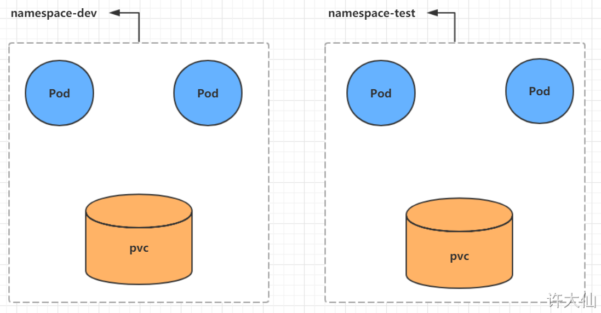
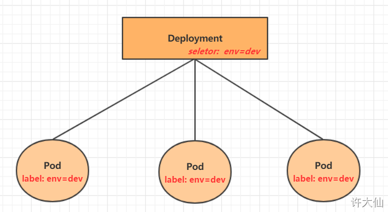

### kubernetes介绍

##### k8s本质

kubernetes的本质是一组服务器集渠群，它可以在集群的每个节点上运行特定的程序，来对节点中的容器进行管理。
它的目的就是是实现资源管理的自动化，主要提供了如下的主要功能：

·自我修复：一旦某一个容器崩溃，能够在1秒中左右迅速启动新的容器·弹性伸缩：可以根据需要，自动对集群中正在运行的容器数量进行调整
·服务发现：服务可以通过自动发现的形式找到它所依赖的服务
·负载均衡：如果一个服务起动了多个容器，能够自动实现请求的负载均衡
·版本回退：如果发现新发布的程序版本有问题，可以立即回退到原来的版本
·存储编排：可以根据容器自身的需求自动创建存储卷

##### k8s组件

一个kubernetes集群主要是由控制节点（master）、工作节点（node）构成，每个节点上都会安装不同的组件。

master：集群的控制平面，负责集群的决策（管理）

1. ApiServer：资源操作的唯一入口，接收用户输入的命令，提供认证、授权、API注册和发现等机制
2. Scheduler：负责集群资源调度，按照预定的调度策略将Pod调度到相应的node节点上
3. ControllerManager：负责维护集群的状态，比如程序部署安排、故障检测、自动扩展、滚动更新等
4. Etcd：负责存储集群中各种资源对象的信息

node：集群的数据平面，负责为容器提供运行环境（干活）

1. Kubelet：负责维护容器的生命周期，即通过控制docker，来创建、更新、销毁容器
2. KubeProxy：负责提供集群内部的服务发现和负载均衡
3. Docker：负责节点上容器的各种操作
4. 

>kubernetes 组件调用关系的应用示例

以部署一个 Nginx 服务来说明 Kubernetes 系统各个组件调用关系

1. 首先需要明确，一旦 Kubernetes 环境启动之后，master 和 node 都会将自身的信息存储到etcd数据库中。
2. 一个Nginx服务的安装请求首先会被发送到 master 节点上的 API Server 组件
3. API Server 组件会调用 Scheduler 组件来决定到底应该把这个服务安装到那个 node 节点上。此时，它会从 etcd 中读取各个 node 节点的信息，然后按照一定的算法进行选择，并将结果告知 API Server 
4.  API Server 调用 Controller-Manager 去调用 Node 节点安装 Nginx 服务
5. Kubelet 接收到指令后，会通知 Docker ，然后由 Docker 来启动一个 Nginx 的 Pod 。Pod 是 Kubernetes 的最小操作单元，容器必须跑在 Pod 中
6. 一个 Nginx 服务就运行了，如果需要访问 Nginx ，就需要通过 kube-proxy 来对 Pod 产生访问的代理，这样，外界用户就可以访问集群中的 Nginx 服务了。


##### k8s概念

Master：集群控制节点，每个集群需要至少一个master节点负责集群的管控

Node：工作负载节点，由master分配容器到这些node工作节点上，然后node节点上的docker负责容器的运行

Pod:kubernetes的最小控制单元，容副都是运行在pod中的，一个pod中可以有1个或者多个容器

Controller：控制器，通过它来实现对pod的管理，比如启动pod、停止pod、伸缩pod的数量等等

Service:pod对外服务的统一入口，下面可以维护者同一类的多个pod 

Label：标签，用于对pod进行分类，同一类pod会拥有相同的标签

NameSpace：命名空间，用来隔离pod的运行环境

### 集群环境搭建

##### 集群类别

k8s集群大体上分为两类：一主多从和多主多从

1. 一主多从：一台master节点和多台node节点，搭建简单，但是有单机故障风险，适用于测试环境

2. 多主多从：多台master节点和多台node节点，搭建麻烦，安全性高，适用于生产环境

   


##### 安装方式

kubernetes有多种部署方式，目前主流的方式有kubeadm、minikube、二进制包

1. minikube：一个用于快速搭建单节点kubernetes的工具
2. kubeadm：一个用于快速搭建kubernetes集群的工具
3. 二进制包：从官网下载每个组件的二进制包，依次去安装，此方式对于理解kubernetes组件更加有效


> 环境搭建（一主二从）

本次环境搭建需要三台CentOS服务器（一主二从），然后在每台服务器中分别安装Docker（18.06.3）、kubeadm（1.18.0）、kubectl（1.18.0）和kubelet（1.18.0）

没有特殊说明，就是三台机器都需要执行

> 环境初始化


```yaml
#检查操作系统的版本（要求操作系统的版本至少在7.5以上）
cat /etc/redhat-release
#关闭防火墙和禁止防火墙开机启动
systemctl stop firewalld
systemctl disable firewalld
#设置主机名  hostnamectl set-hostname <hostname>
#设置192.168.18.100的主机名
hostnamectl set-hostname k8s-master
#设置192.168.18.101的主机名：
hostnamectl set-hostname k8s-node1
#设置192.168.18.102的主机名：
hostnamectl set-hostname k8s-node2
#主机名解析
#为了方便后面集群节点间的直接调用，需要配置一下主机名解析，企业中推荐使用内部的DNS服务器
cat >> /etc/hosts << EOF
192.168.18.100 k8s-master
192.168.18.101 k8s-node1
192.168.18.102 k8s-node2
EOF

#时间同步
#kubernetes要求集群中的节点时间必须精确一致，所以在每个节点上添加时间同步
yum install ntpdate -y
ntpdate time.windows.com

#关闭selinux  
#查看selinux是否开启
getenforce
#永久关闭selinux，需要重启：
sed -i 's/enforcing/disabled/' /etc/selinux/config
#临时关闭selinux，重启之后，无效：
setenforce 0

#关闭swap分区
#永久关闭swap分区，需要重启：
sed -ri 's/.*swap.*/#&/' /etc/fstab
#临时关闭swap分区，重启之后，无效：
swapoff -a

#将桥接的IPv4流量传递到iptables的链
#在每个节点上将桥接的IPv4流量传递到iptables的链
cat > /etc/sysctl.d/k8s.conf << EOF
net.bridge.bridge-nf-call-ip6tables = 1
net.bridge.bridge-nf-call-iptables = 1
net.ipv4.ip_forward = 1
vm.swappiness = 0
EOF

# 加载br_netfilter模块
modprobe br_netfilter

# 查看是否加载
lsmod | grep br_netfilter

# 生效
sysctl --system

#开启ipvs
#在kubernetes中service有两种代理模型，一种是基于iptables，另一种是基于ipvs的。ipvs的性能要高于iptables的，但是如果要使用它，需要手动载入ipvs模块
#在每个节点安装ipset和ipvsadm：
yum -y install ipset ipvsadm
#在所有节点执行如下脚本：
cat > /etc/sysconfig/modules/ipvs.modules <<EOF
#!/bin/bash
modprobe -- ip_vs
modprobe -- ip_vs_rr
modprobe -- ip_vs_wrr
modprobe -- ip_vs_sh
modprobe -- nf_conntrack_ipv4
EOF
#授权、运行、检查是否加载
chmod 755 /etc/sysconfig/modules/ipvs.modules && bash /etc/sysconfig/modules/ipvs.modules && lsmod | grep -e ip_vs -e nf_conntrack_ipv4
#检查是否加载
lsmod | grep -e ipvs -e nf_conntrack_ipv4

#重启三台机器
reboot


#每个节点安装Docker、kubeadm、kubelet和kubectl
#安装Docker
wget https://mirrors.aliyun.com/docker-ce/linux/centos/docker-ce.repo -O /etc/yum.repos.d/docker-ce.repo
yum -y install docker-ce-18.06.3.ce-3.el7
systemctl enable docker && systemctl start docker
docker version
#设置Docker镜像加速器
sudo mkdir -p /etc/docker

sudo tee /etc/docker/daemon.json <<-'EOF'
{
  "exec-opts": ["native.cgroupdriver=systemd"],	
  "registry-mirrors": ["https://du3ia00u.mirror.aliyuncs.com"],	
  "live-restore": true,
  "log-driver":"json-file",
  "log-opts": {"max-size":"500m", "max-file":"3"},
  "storage-driver": "overlay2"
}
EOF

sudo systemctl daemon-reload
sudo systemctl restart docker

#添加阿里云的YUM软件源
cat > /etc/yum.repos.d/kubernetes.repo << EOF
[kubernetes]
name=Kubernetes
baseurl=https://mirrors.aliyun.com/kubernetes/yum/repos/kubernetes-el7-x86_64
enabled=1
gpgcheck=0
repo_gpgcheck=0
gpgkey=https://mirrors.aliyun.com/kubernetes/yum/doc/yum-key.gpg https://mirrors.aliyun.com/kubernetes/yum/doc/rpm-package-key.gpg
EOF

#安装kubeadm、kubelet和kubectl
#由于版本更新频繁，这里指定版本号部署
yum install -y kubelet-1.18.0 kubeadm-1.18.0 kubectl-1.18.0
#为了实现Docker使用的cgroup drvier和kubelet使用的cgroup drver一致，建议修改"/etc/sysconfig/kubelet"文件的内容
vim /etc/sysconfig/kubelet
# 修改
KUBELET_EXTRA_ARGS="--cgroup-driver=systemd"
KUBE_PROXY_MODE="ipvs"

#设置为开机自启动即可，由于没有生成配置文件，集群初始化后自动启动
systemctl enable kubelet
#查看k8s所需镜像
kubeadm config images list
#部署k8s的Master节点
# 由于默认拉取镜像地址k8s.gcr.io国内无法访问，这里需要指定阿里云镜像仓库地址
kubeadm init \
  --apiserver-advertise-address=192.168.18.100 \
  --image-repository registry.aliyuncs.com/google_containers \
  --kubernetes-version v1.18.0 \
  --service-cidr=10.96.0.0/12 \
  --pod-network-cidr=10.244.0.0/16
#根据提示消息，在Master节点上使用kubectl工具
mkdir -p $HOME/.kube
sudo cp -i /etc/kubernetes/admin.conf $HOME/.kube/config
sudo chown $(id -u):$(id -g) $HOME/.kube/config
#部署k8s的Node节点
#根据提示，在192.168.18.101和192.168.18.102上添加如下的命令
kubeadm join 192.168.18.100:6443 --token jv039y.bh8yetcpo6zeqfyj \
    --discovery-token-ca-cert-hash sha256:3c81e535fd4f8ff1752617d7a2d56c3b23779cf9545e530828c0ff6b507e0e26
    
#默认的token有效期为2小时，当过期之后，该token就不能用了，这时可以使用如下的命令创建token：
kubeadm token create --print-join-command
# 生成一个永不过期的token
kubeadm token create --ttl 0 --print-join-command

#部署CNI网络插件
#根据提示，在Master节点上使用kubectl工具查看节点状态：
kubectl get nodes
#kubernetes支持多种网络插件，比如flannel、calico、canal等，任选一种即可，本次选择flannel
#在Master节点上获取flannel配置文件(可能会失败，如果失败，请下载到本地，然后安装)：
wget https://raw.githubusercontent.com/coreos/flannel/master/Documentation/kube-flannel.yml
#使用配置文件启动flannel：
kubectl apply -f https://raw.githubusercontent.com/coreos/flannel/master/Documentation/kube-flannel.yml
#查看部署CNI网络插件进度：
kubectl get pods -n kube-system
#再次在Master节点使用kubectl工具查看节点状态：
kubectl get nodes

#查看集群健康状况：
kubectl get cs
kubectl cluster-info
```


> 服务部署

在Kubernetes集群中部署一个Nginx程序，测试下集群是否正常工作

```shell
#部署Nginx：
kubectl create deployment nginx --image=nginx:1.14-alpine
#暴露端口：
kubectl expose deployment nginx --port=80 --type=NodePort
#查看服务状态：
kubectl get pods,svc
#最后网页上测试是否能访问nginx页面
```

>kubernetes中kubectl命令自动补全


```shell
yum install -y bash-completion
source /usr/share/bash-completion/bash_completion
source <(kubectl completion bash)
echo “source <(kubectl completion bash)” >> ~/.bashrc
 vim /root/.bashrc 
 source /usr/share/bash-completion/bash_completion
 source <(kubectl completion bash)
```


**视频版安装 k8s **

https://bizsec-auth.alicdn.com/a9b5b21ee64d2b47/Qe9k4XSEr4zqvIg7131/mIGvq9q17FjgLhxkeFt_343638797606___hd.mp4?auth_key=1654251965-0-0-1a9425a1e6ca8c433caed7a04039671b&t=212cf1a316542492654518283e5fc0&b=video&p=cloudvideo_http_800000012_0


### k8s资源管理

##### 资源管理介绍

1. 在Kubernetes中，所有的内容都抽象为资源，用户需要通过操作资源来管理Kubernetes
2. Kubernetes的本质就是一个集群系统，用户可以在集群中部署各种服务。所谓的部署服务，其实就是在Kubernetes集群中运行一个个的容器，并将指定的程序跑在容器中。
3. Kubernetes的最小管理单元是Pod而不是容器，所以只能将容器放在`Pod`中，而Kubernetes一般也不会直接管理Pod，而是通过`Pod控制器`来管理Pod的。
4. Pod提供服务之后，就需要考虑如何访问Pod中的服务，Kubernetes提供了`Service`资源实现这个功能。
5. 当然，如果Pod中程序的数据需要持久化，Kubernetes还提供了各种`存储`系统。

学习kubernets的核心，就是学习如何对集群中的`Pod`、`Pod控制器`、`Service`、`存储`等各种资源进行操作

##### YAML语法介绍

YAML是一个类似于XML、JSON的标记性语言。它强调的是以“数据”为中心，并不是以标记语言为重点。因而YAML本身的定义比较简单，号称是“一种人性化的数据格式语言”

YAML的语法比较简单，主要有下面的几个：

1.   大小写敏感。
2.   使用缩进表示层级关系。
3.   缩进不允许使用tab，只允许空格（低版本限制）。
4.   缩进的空格数不重要，只要相同层级的元素左对齐即可。
5.   ‘#’表示注释。

YAML支持以下几种数据类型：

1.   常量：单个的、不能再分的值。
2. 对象：键值对的集合，又称为映射/哈希/字典
3.   数组：一组按次序排列的值，又称为序列/列表。

```yaml
#常量，就是指的是一个简单的值，字符串、布尔值、整数、浮点数、NUll、时间、日期
# 布尔类型
c1: true
# 整型
c2: 123456
# 浮点类型
c3: 3.14
# null类型
c4: ~ # 使用~表示null
# 日期类型
c5: 2019-11-11 # 日期类型必须使用ISO 8601格式，即yyyy-MM-dd
# 时间类型
c6: 2019-11-11T15:02:31+08.00 # 时间类型使用ISO 8601格式，时间和日期之间使用T连接，最后使用+代表时区
# 字符串类型
c7: haha # 简单写法，直接写值，如果字符串中间有特殊符号，必须使用双引号或单引号包裹
c8: line1
    line2 # 字符串过多的情况可以折成多行，每一行都会转换成一个空格
    
# 对象
# 形式一（推荐）：
xudaxian:	
	name: 许大仙
	age: 16
# 形式二（了解）：
xuxian: { name: 许仙, age: 18 }


# 数组
# 形式一（推荐）：
address:
	- 江苏
	- 北京
# 形式二（了解）：
address: [江苏,上海]
```


##### 资源管理方式

命令式对象管理：直接使用命令去操作kubernetes的资源。

```shell
kubectl run nginx-pod --image=nginx:1.17.1 --port=80
```


命令式对象配置：通过命令配置和配置文件去操作kubernetes的资源

```shell
kubectl create/patch -f nginx-pod.yaml
```


声明式对象配置：通过apply命令和配置文件去操作kubernetes的资源。

```shell
kubectl apply -f nginx-pod.yaml
```


| 类型           | 操作 | 适用场景 | 优点           | 缺点                               |
| -------------- | ---- | -------- | -------------- | ---------------------------------- |
| 命令式对象管理 | 对象 | 测试     | 简单           | 只能操作活动对象，无法审计、跟踪   |
| 命令式对象配置 | 文件 | 开发     | 可以审计、跟踪 | 项目大的时候，配置文件多，操作麻烦 |
| 声明式对象配置 | 目录 | 开发     | 支持目录操作   | 意外情况下难以调试                 |


>命令式对象管理

**kubectl命令**

kubectl是kubernetes集群的命令行工具，通过它能够对集群本身进行管理，并能够在集群上进行容器化应用的安装和部署

```shell
kubectl [command] [type] [name] [flags]
# command：指定要对资源执行的操作，比如create、get、delete。
#  type：指定资源的类型，比如deployment、pod、service。
# name：指定资源的名称，名称大小写敏感。
# flags：指定额外的可选参数。
# 示例：查看所有的pod
kubectl get pods
#示例：查看某个pod
kubectl get pod pod_name
#示例：查看某个pod，以yaml格式展示结果
kubectl get pod pod_name -o yaml
```


**操作（command）**

```shell
#kubernetes允许对资源进行多种操作，可以通过--help查看详细的操作命令：
kubectl --help
```

经常使用的操作如下所示:

基本命令：

| 命令    | 翻译 | 命令作用     |
| ------- | ---- | ------------ |
| create  | 创建 | 创建一个资源 |
| edit    | 编辑 | 编辑一个资源 |
| get     | 获取 | 获取一个资源 |
| patch   | 更新 | 更新一个资源 |
| delete  | 删除 | 删除一个资源 |
| explain | 解释 | 展示资源文档 |


运行和调试：

| 命令      | 翻译     | 命令作用                   |
| --------- | -------- | -------------------------- |
| run       | 运行     | 在集群中运行一个指定的镜像 |
| expose    | 暴露     | 暴露资源为Service          |
| describe  | 描述     | 显示资源内部信息           |
| logs      | 日志     | 输出容器在Pod中的日志      |
| attach    | 缠绕     | 进入运行中的容器           |
| exec      | 执行     | 执行容器中的一个命令       |
| cp        | 复制     | 在Pod内外复制文件          |
| rollout   | 首次展示 | 管理资源的发布             |
| scale     | 规模     | 扩（缩）容Pod的数量        |
| autoscale | 自动调整 | 自动调整Pod的数量          |


高级命令：

| 命令  | 翻译 | 命令作用               |
| ----- | ---- | ---------------------- |
| apply | 应用 | 通过文件对资源进行配置 |
| label | 标签 | 更新资源上的标签       |


其他命令：

| 命令         | 翻译     | 命令作用                     |
| ------------ | -------- | ---------------------------- |
| cluster-info | 集群信息 | 显示集群信息                 |
| version      | 版本     | 显示当前Client和Server的版本 |


**资源类型（type）**

```shell
#kubernetes中所有的内容都抽象为资源，可以通过下面的命令进行查看：
kubectl api-resources
```


经常使用的资源如下所示：

集群级别资源：

| 资源名称   | 缩写 | 资源作用     |
| ---------- | ---- | ------------ |
| nodes      | no   | 集群组成部分 |
| namespaces | ns   | 隔离Pod      |


Pod资源：

| 资源名称 | 缩写 | 资源作用 |
| -------- | ---- | -------- |
| Pods     | po   | 装载容器 |


Pod资源控制器：

| 资源名称                 | 缩写   | 资源作用    |
| ------------------------ | ------ | ----------- |
| replicationcontrollers   | rc     | 控制Pod资源 |
| replicasets              | rs     | 控制Pod资源 |
| deployments              | deploy | 控制Pod资源 |
| daemonsets               | ds     | 控制Pod资源 |
| jobs                     |        | 控制Pod资源 |
| cronjobs                 | cj     | 控制Pod资源 |
| horizontalpodautoscalers | hpa    | 控制Pod资源 |
| statefulsets             | sts    | 控制Pod资源 |


服务发现资源：

| 资源名称 | 缩写 | 资源作用        |
| -------- | ---- | --------------- |
| services | svc  | 统一Pod对外接口 |
| ingress  | ing  | 统一Pod对外接口 |


存储资源：

| 资源名称               | 缩写 | 资源作用 |
| ---------------------- | ---- | -------- |
| volumeattachments      |      | 存储     |
| persistentvolumes      | pv   | 存储     |
| persistentvolumeclaims | pvc  | 存储     |


配置资源：

| 资源名称   | 缩写 | 资源作用 |
| ---------- | ---- | -------- |
| configmaps | cm   | 配置     |
| secrets    |      | 配置     |


**应用示例**

```shell
#创建一个namespace
kubectl create namespace dev
#示例：获取namespace
kubectl get namespace
kubectl get ns
#示例：在刚才创建的namespace下创建并运行一个Nginx的Pod
kubectl run nginx --image=nginx:1.17.1 -n dev
#示例：查看名为dev的namespace下的所有Pod，如果不加-n，默认就是default的namespace
kubectl get pods -n dev
#示例：删除指定namespace下的指定Pod
kubectl delete pod nginx -n dev
#示例：删除指定的namespace
kubectl delete namespace dev

```


>命令式对象配置

**概述**

命令式对象配置：通过命令配置和配置文件去操作kubernetes的资源。

**应用示例**

创建一个nginxpod.yaml，内容如下：

```yaml
apiVersion: v1
kind: Namespace
metadata:
	name: dev
---
apiVersion: v1
kind: Pod
metadata:
	name: nginxpod
	namespace: dev
spec:
	containers:
		- name: nginx-containers
		  image: nginx:1.17.1
```


```shell
#执行create命令，创建资源：
kubectl create -f nginxpod.yaml
#执行get命令，查看资源：
kubectl get -f nginxpod.yaml
#执行delete命令，删除资源：
kubectl delete -f nginxpod.yaml
```

**总结**

命令式对象配置的方式操作资源，可以简单的认为：命令+yaml配置文件（里面是命令需要的各种参数）。


>声明式对象配置


**概述**

1. 声明式对象配置：通过apply命令和配置文件去操作kubernetes的资源。
2. 声明式对象配置和命令式对象配置类似，只不过它只有一个apply命令。
3. apply相当于create和patch。

**应用示例**

```shell
kubectl apply -f nginxpod.yaml
```

**总结**

- 声明式对象配置就是使用apply描述一个资源的最终状态（在yaml中定义状态）。
- 使用apply操作资源：

- - 如果资源不存在，就创建，相当于kubectl create。

- - 如果资源存在，就更新，相当于kubectl patch。


>使用方式推荐

- 创建和更新资源使用声明式对象配置：kubectl apply -f xxx.yaml。

- 删除资源使用命令式对象配置：kubectl delete -f xxx.yaml。

- 查询资源使用命令式对象管理：kubectl get(describe) 资源名称。


>扩展：kubectl可以在Node上运行

kubectl的运行需要进行配置，它的配置文件是$HOME/.kube，如果想要在Node节点上运行此命令，需要将Master节点的.kube文件夹复制到Node节点上，即在Master节点上执行下面的操作：

```shell
scp -r $HOME/.kube k8s-node1:$HOME
```


##### 如何快速的编写yaml文件

**使用kubectl create命令生成yaml文件**

此种方式适用于没有真正部署资源。

```shell
#使用kubectl create命令生成yaml文件：
kubectl create deployment nginx --image=nginx:1.17.1 --dry-run=client -n dev -o yaml
#如果yaml文件太长，可以写入到指定的文件中。
kubectl create deployment nginx --image=nginx:1.17.1 --dry-run=client -n dev -o yaml > test.yaml
```


**使用kubectl get命令导出yaml文件（此种方式已经不建议使用）**

此种方式适合于资源已经部署，动态的导出yaml文件。
此种方式会在未来版本中删除，因此不再建议使用。

```shell
#创建一个Deployment：
kubectl create deployment nginx --image=nginx:1.17.1 -n dev
#使用kubectl get命令导出yaml文件：
kubectl get deployment nginx -n dev -o yaml --export > test2.yaml
```


### k8s的实战入门

介绍如何在kubernetes集群中部署一个Nginx服务，并且能够对其访问。

##### Namespace

**概述**

1. ​	Namespace是kubernetes系统中一种非常重要的资源，它的主要作用是用来实现`多套系统的资源隔离`或者`多租户的资源隔离`。
2. 默认情况下，kubernetes集群中的所有Pod都是可以相互访问的。但是在实际中，可能不想让两个Pod之间进行互相的访问，那么此时就可以将两个Pod划分到不同的Namespace下。kubernetes通过将集群内部的资源分配到不同的Namespace中，可以形成逻辑上的“组”，以方便不同的组的资源进行隔离使用和管理。
3. 可以通过kubernetes的授权机制，将不同的Namespace交给不同租户进行管理，这样就实现了多租户的资源隔离。此时还能结合kubernetes的资源配额机制，限定不同租户能占用的资源，例如CPU使用量、内存使用量等等，来实现租户可用资源的管理。





```shell
#kubernetes在集群启动之后，会默认创建几个namespace
kubectl get namespace
```


**应用示例**

```shell
#查看所有的命名空间
kubectl get namespace
kubectl get ns
#查看指定的命名空间
kubectl get namespace default
kubectl get ns default
#指定命名空间的输出格式
kubectl get ns default -o wide
kubectl get ns default -o json
kubectl get ns default -o yaml
#查看命名空间的详情
kubectl describe namespace default
kubectl describe ns default
#创建命名空间
kubectl create namespace dev
kubectl create ns dev
#删除命名空间
kubectl delete ns dev

```

命令式对象配置

```yaml
#新建ns-dev.yaml：
apiVersion: v1
kind: Namespace
metadata:
  name: dev
  
#通过命令式对象配置进行创建和删除：
kubectl create -f ns-dev.yaml
kubectl delete -f ns-dev.yaml
```


##### Pod

**概述**

1. Pod是kubernetes集群进行管理的最小单元，程序要运行必须部署在容器中，而容器必须存在于Pod中。
2. Pod可以认为是容器的封装，一个Pod中可以存在一个或多个容器。


kubernetes在集群启动之后，集群中的各个组件也是以Pod方式运行的，可以通过下面的命令查看：

```shell
kubectl get pods -n kube-system
```


**语法及应用示例**

```yaml
#语法：创建并运行Pod	kubectl run (Pod的名称) [参数]
# --image 指定Pod的镜像
# --port 指定端口
# --namespace 指定namespace
#示例：在名称为dev的namespace下创建一个Nginx的Pod
kubectl run nginx --image=nginx:1.17.1 --port=80 --namespace=dev

#语法：查询所有Pod的基本信息   kubectl get pods [-n 命名空间的名称]
#示例：查询名称为dev的namespace下的所有Pod的基本信息
kubectl get pods -n dev

#语法：查看Pod的详细信息 kubectl describe pod pod的名称 [-n 命名空间名称]
#示例：查看名称为dev的namespace下的Pod的名称为nginx的详细信息
kubectl describe pod nginx -n dev

#Pod的访问
# 获取Pod的IP
kubectl get pods [-n dev] -o wide
# 通过curl访问
curl ip:端口
#示例：访问Nginx的Pod
kubectl get pods -n dev -o wide
curl 10.244.2.7:80

#语法：删除指定的Pod	kubectl delete pod pod的名称 [-n 命名空间]
#示例：删除Nginx的Pod
kubectl delete pod nginx -n dev

# 示例：命令式对象配置
# 1 新建pod-nginx.yaml：
apiVersion: v1
kind: Pod
metadata:
  name: nginx
  namespace: dev
spec:
  containers:
  - image: nginx:1.17.1
    imagePullPolicy: IfNotPresent
    name: pod
    ports: 
    - name: nginx-port
      containerPort: 80
      protocol: TCP

# 2 执行创建和删除命令：
kubectl create -f pod-nginx.yaml
kubectl delete -f pod-nginx.yaml
```


##### Label

**概述**

Label是kubernetes的一个重要概念。它的作用就是在资源上添加标识，用来对它们进行区分和选择。

Label的特点：

1.   一个Label会以key/value键值对的形式附加到各种对象上，如Node、Pod、Service等。
2.   一个资源对象可以定义任意数量的Label，同一个Label也可以被添加到任意数量的资源对象上去。
3.   Label通常在资源对象定义时确定，当然也可以在对象创建后动态的添加或删除。

可以通过Label实现资源的多纬度分组，以便灵活、方便地进行资源分配、调度、配置和部署等管理工作。


一些常用的Label标签示例如下：

- 版本标签：“version”:”release”,”version”:”stable”。。。

- 环境标签：“environment”:”dev”,“environment”:”test”,“environment”:”pro”。。。

- 架构标签：“tier”:”frontend”,”tier”:”backend”。。。


- 标签定义完毕之后，还要考虑到标签的选择，这就要用到Label Selector，即：

- - Label用于给某个资源对象定义标识。

- - Label Selector用于查询和筛选拥有某些标签的资源对象。

- 当前有两种Label Selector：

- - 基于等式的Label Selector。

- - - name=slave：选择所有包含Label中的key=“name”并且value=“slave”的对象。

- - - env!=production：选择所有包含Label中的key=“env”并且value!=“production”的对象。

- - 基于集合的Label Selector。

- - - name in (master,slave)：选择所有包含Label中的key=“name”并且value=“master”或value=“slave”的对象。

- - - name not in (master,slave)：选择所有包含Label中的key=“name”并且value!=“master”和value!=“slave”的对象。

- 标签的选择条件可以使用多个，此时将多个Label Selector进行组合，使用逗号（,）进行分隔即可。

- - name=salve,env!=production。

- - name not in (master,slave),env!=production。


**语法及应用示例**

```yaml
#语法：为资源打标签 kubectl label pod xxx key=value [-n 命名空间]
#示例：为Nginx的Pod打上标签
kubectl label pod nginx version=1.0 -n dev

#语法：更新资源的标签 kubectl label pod xxx key=value [-n 命名空间] --overwrite
#示例：为Nginx的Pod更新标签
kubectl label pod nginx version=2.0 -n dev --overwrite

#语法：查看标签	kubectl get pod xxx [-n 命名空间] --show-labels
#显示Nginx的Pod的标签
kubectl get pod nginx -n dev --show-labels

#语法：筛选标签	kubectl get pod -l key=value [-n 命名空间] --show-labels
#示例：筛选版本号是2.0的在名称为dev的namespace下的Pod
kubectl get pod -l version=2.0 -n dev --show-labels

#语法：删除标签	kubectl label pod xxx key- [-n 命名空间]
#示例：删除名称为dev的namespace下的Nginx的Pod上的标签
kubectl label pod nginx version- -n dev

```

示例：命令式对象配置

1 新建pod-nginx.yaml：

```yaml
apiVersion: v1
kind: Pod
metadata:
  name: nginx
  namespace: dev
  labels:
    version: "3.0"
    env: "test"        
spec:
  containers:
  - image: nginx:1.17.1
    imagePullPolicy: IfNotPresent
    name: pod
    ports: 
    - name: nginx-port
      containerPort: 80
      protocol: TCP
```

2 执行创建和删除命令：

```shell
kubectl create -f pod-nginx.yaml
kubectl delete -f pod-nginx.yaml
```


##### Deployment

**概述**

1. 在kubernetes中，Pod是最小的控制单元，但是kubernetes很少直接控制Pod，一般都是通过Pod控制器来完成的。
2. Pod控制器用于Pod的管理，确保Pod资源符合预期的状态，当Pod的资源出现故障的时候，会尝试进行重启或重建Pod。
3. 在kubernetes中Pod控制器的种类有很多，本章节只介绍一种：Deployment。





**语法及应用示例**

特别注意：在v1.18版之后，kubectl run nginx --image=nginx --replicas=2 --port=80，会反馈Flag --replicas has been deprecated, has no effect and will be removed in the future，并且只会创建一个Nginx容器实例。

```shell
#语法：创建指定名称的deployement	kubectl create deployment xxx [-n 命名空间]	kubectl create deploy xxx [-n 命名空间]
#示例：在名称为test的命名空间下创建名为nginx的deployment
kubectl create deployment nginx --image=nginx:1.17.1 -n test

#语法：根据指定的deplyment创建Pod	kubectl scale deployment xxx [--replicas=正整数] [-n 命名空间]
#示例：在名称为test的命名空间下根据名为nginx的deployment创建4个Pod
kubectl scale deployment nginx --replicas=4 -n dev

#语法：查看创建的Pod	kubectl get pods [-n 命名空间]
#示例：查看名称为dev的namespace下通过deployment创建的3个Pod
kubectl get pods -n dev

#语法：查看deployment的信息	kubectl get deployment [-n 命名空间]	kubectl get deploy [-n 命名空间]
#示例：查看名称为dev的namespace下的deployment
kubectl get deployment -n dev

#语法：查看deployment的详细信息	kubectl describe deployment xxx [-n 命名空间]	kubectl describe deploy xxx [-n 命名空间]
#示例：查看名为dev的namespace下的名为nginx的deployment的详细信息
kubectl describe deployment nginx -n dev

#语法：删除deployment	kubectl delete deployment xxx [-n 命名空间]	kubectl delete deploy xxx [-n 命名空间]
#示例：删除名为dev的namespace下的名为nginx的deployment
kubectl delete deployment nginx -n dev

```

命令式对象配置

1 创建一个deploy-nginx.yaml，内容如下：

```yaml
apiVersion: apps/v1
kind: Deployment
metadata:
  name: nginx
  namespace: dev
spec:
  replicas: 3
  selector:
    matchLabels:
      run: nginx
  template:
    metadata:
      labels:
        run: nginx
    spec:
      containers:
      - image: nginx:1.17.1
        name: nginx
        ports:
        - containerPort: 80
          protocol: TCP
```

2 执行创建和删除命令：

```shell
kubectl create -f deploy-nginx.yaml
kubectl delete -f deploy-nginx.yaml
```


##### Service

**概述**

我们已经能够利用Deployment来创建一组Pod来提供具有高可用性的服务，虽然每个Pod都会分配一个单独的Pod的IP地址，但是却存在如下的问题：

1. Pod的IP会随着Pod的重建产生变化。
2. Pod的IP仅仅是集群内部可见的虚拟的IP，外部无法访问。


这样对于访问这个服务带来了难度，因此，kubernetes设计了Service来解决这个问题。
Service可以看做是一组同类的Pod对外的访问接口，借助Service，应用可以方便的实现服务发现和负载均衡。


**语法及应用示例**

创建集群内部可访问的Service

```shell
#语法：暴露Service	
#kubectl expose deployment xxx --name=服务名 --type=ClusterIP --port=暴露的端口 --target-port=指向集群中的Pod的端口 [-n 命名空间]
# 会产生一个CLUSTER-IP，这个就是service的IP，在Service的生命周期内，这个地址是不会变化的
#示例：暴露名为test的namespace下的名为nginx的deployment，并设置服务名为svc-nginx1
kubectl expose deployment nginx --name=svc-nginx1 --type=ClusterIP --port=80 --target-port=80 -n test

#语法：查看Service	kubectl get service [-n 命名空间] [-o wide]
#示例：查看名为test的命名空间的所有Service
kubectl get service -n test

```


创建集群外部可访问的Service

```shell
#语法：暴露Service	
#kubectl expose deployment xxx --name=服务名 --type=NodePort --port=暴露的端口 --target-port=指向集群中的Pod的端口 [-n 命名空间]
# 会产生一个外部也可以访问的Service
#示例：暴露名为test的namespace下的名为nginx的deployment，并设置服务名为svc-nginx2
kubectl expose deploy nginx --name=svc-nginx2 --type=NodePort --port=80 --target-port=80 -n test

#语法：查看Service	kubectl get service [-n 命名空间] [-o wide]
#示例：查看名为test的命名空间的所有Service
kubectl get service -n test
```


删除服务

```shell
#kubectl delete service xxx [-n 命名空间]
kubectl delete service svc-nginx1 -n test
```

对象配置方式

1 新建svc-nginx.yaml，内容如下：

```yaml
apiVersion: v1
kind: Service
metadata:
  name: svc-nginx
  namespace: dev
spec:
  clusterIP: 10.109.179.231
  ports:
  - port: 80
    protocol: TCP
    targetPort: 80
  selector:
    run: nginx
  type: ClusterIP
```

2 执行创建和删除命令：

```shell
kubectl  create  -f  svc-nginx.yaml
kubectl  delete  -f  svc-nginx.yaml
```


### k8s的Pod详解

详细介绍Pod资源的各种配置（YAML）和原理。

##### Pod的介绍

> Pod的结构

每个Pod中都包含一个或者多个容器，这些容器可以分为两类：

用户程序所在的容器，数量可多可少。

Pause容器，这是每个Pod都会有的一个根容器，它的作用有两个：

- - 可以以它为依据，评估整个Pod的健康状况。

- - 可以在根容器上设置IP地址，其它容器都共享此IP（Pod的IP），以实现Pod内部的网络通信（这里是Pod内部的通讯，Pod之间的通讯采用虚拟二层网络技术来实现，我们当前环境使用的是Flannel）。

>Pod定义

下面是Pod的资源清单：

```yaml
apiVersion: v1     #必选，版本号，例如v1
kind: Pod       　 #必选，资源类型，例如 Pod
metadata:       　 #必选，元数据
  name: string     #必选，Pod名称
  namespace: string  #Pod所属的命名空间,默认为"default"
  labels:       　　  #自定义标签列表
    - name: string      　          
spec:  #必选，Pod中容器的详细定义
  containers:  #必选，Pod中容器列表
  - name: string   #必选，容器名称
    image: string  #必选，容器的镜像名称
    imagePullPolicy: [ Always|Never|IfNotPresent ]  #获取镜像的策略 
    command: [string]   #容器的启动命令列表，如不指定，使用打包时使用的启动命令
    args: [string]      #容器的启动命令参数列表
    workingDir: string  #容器的工作目录
    volumeMounts:       #挂载到容器内部的存储卷配置
    - name: string      #引用pod定义的共享存储卷的名称，需用volumes[]部分定义的的卷名
      mountPath: string #存储卷在容器内mount的绝对路径，应少于512字符
      readOnly: boolean #是否为只读模式
    ports: #需要暴露的端口库号列表
    - name: string        #端口的名称
      containerPort: int  #容器需要监听的端口号
      hostPort: int       #容器所在主机需要监听的端口号，默认与Container相同
      protocol: string    #端口协议，支持TCP和UDP，默认TCP
    env:   #容器运行前需设置的环境变量列表
    - name: string  #环境变量名称
      value: string #环境变量的值
    resources: #资源限制和请求的设置
      limits:  #资源限制的设置
        cpu: string     #Cpu的限制，单位为core数，将用于docker run --cpu-shares参数
        memory: string  #内存限制，单位可以为Mib/Gib，将用于docker run --memory参数
      requests: #资源请求的设置
        cpu: string    #Cpu请求，容器启动的初始可用数量
        memory: string #内存请求,容器启动的初始可用数量
    lifecycle: #生命周期钩子
		postStart: #容器启动后立即执行此钩子,如果执行失败,会根据重启策略进行重启
		preStop: #容器终止前执行此钩子,无论结果如何,容器都会终止
    livenessProbe:  #对Pod内各容器健康检查的设置，当探测无响应几次后将自动重启该容器
      exec:       　 #对Pod容器内检查方式设置为exec方式
        command: [string]  #exec方式需要制定的命令或脚本
      httpGet:       #对Pod内个容器健康检查方法设置为HttpGet，需要制定Path、port
        path: string
        port: number
        host: string
        scheme: string
        HttpHeaders:
        - name: string
          value: string
      tcpSocket:     #对Pod内个容器健康检查方式设置为tcpSocket方式
         port: number
       initialDelaySeconds: 0       #容器启动完成后首次探测的时间，单位为秒
       timeoutSeconds: 0    　　    #对容器健康检查探测等待响应的超时时间，单位秒，默认1秒
       periodSeconds: 0     　　    #对容器监控检查的定期探测时间设置，单位秒，默认10秒一次
       successThreshold: 0
       failureThreshold: 0
       securityContext:
         privileged: false
  restartPolicy: [Always | Never | OnFailure]  #Pod的重启策略
  nodeName: <string> #设置NodeName表示将该Pod调度到指定到名称的node节点上
  nodeSelector: obeject #设置NodeSelector表示将该Pod调度到包含这个label的node上
  imagePullSecrets: #Pull镜像时使用的secret名称，以key：secretkey格式指定
  - name: string
  hostNetwork: false   #是否使用主机网络模式，默认为false，如果设置为true，表示使用宿主机网络
  volumes:   #在该pod上定义共享存储卷列表
  - name: string    #共享存储卷名称 （volumes类型有很多种）
    emptyDir: {}       #类型为emtyDir的存储卷，与Pod同生命周期的一个临时目录。为空值
    hostPath: string   #类型为hostPath的存储卷，表示挂载Pod所在宿主机的目录
      path: string      　　        #Pod所在宿主机的目录，将被用于同期中mount的目录
    secret:       　　　#类型为secret的存储卷，挂载集群与定义的secret对象到容器内部
      scretname: string  
      items:     
      - key: string
        path: string
    configMap:         #类型为configMap的存储卷，挂载预定义的configMap对象到容器内部
      name: string
      items:
      - key: string
        path: string
```


```shell
#语法：查看每种资源的可配置项
# 查看某种资源可以配置的一级配置
kubectl explain 资源类型 
# 查看属性的子属性
kubectl explain 资源类型.属性

#示例：查看资源类型为pod的可配置项
kubectl explain pod
#示例：查看资源类型为Pod的metadata的属性的可配置项
kubectl explain pod.metadata

```

在kubernetes中基本所有资源的一级属性都是一样的，主要包含5个部分：

- apiVersion  <string>：版本，有kubernetes内部定义，版本号必须用kubectl api-versions查询。

- kind <string>：类型，有kubernetes内部定义，类型必须用kubectl api-resources查询。

- metadata  <Object>：元数据，主要是资源标识和说明，常用的有name、namespace、labels等。

- spec <Object>：描述，这是配置中最重要的一部分，里面是对各种资源配置的详细描述。

- status  <Object>：状态信息，里面的内容不需要定义，由kubernetes自动生成。

在上面的属性中，spec是接下来研究的重点，继续看下它的常见子属性：

- containers  <[]Object>：容器列表，用于定义容器的详细信息。

- nodeName <String>：根据nodeName的值将Pod调度到指定的Node节点上。

- nodeSelector  <map[]> ：根据NodeSelector中定义的信息选择该Pod调度到包含这些Label的Node上。

- hostNetwork  <boolean>：是否使用主机网络模式，默认为false，如果设置为true，表示使用宿主机网络。

- volumes    <[]Object> ：存储卷，用于定义Pod上面挂载的存储信息。

- restartPolicy	<string>：重启策略，表示Pod在遇到故障的时候的处理策略。


##### Pod的配置

**概述**

本小节主要来研究pod.spec.containers属性，这也是Pod配置中最为关键的一项配置

```shell
#示例：查看pod.spec.containers的可选配置项
kubectl explain pod.spec.containers

# 返回的重要属性
KIND:     Pod
VERSION:  v1
RESOURCE: containers <[]Object>   # 数组，代表可以有多个容器FIELDS:
  name  <string>     # 容器名称
  image <string>     # 容器需要的镜像地址
  imagePullPolicy  <string> # 镜像拉取策略 
  command  <[]string> # 容器的启动命令列表，如不指定，使用打包时使用的启动命令
  args   <[]string> # 容器的启动命令需要的参数列表 
  env    <[]Object> # 容器环境变量的配置
  ports  <[]Object>  # 容器需要暴露的端口号列表
  resources <Object> # 资源限制和资源请求的设置
```

