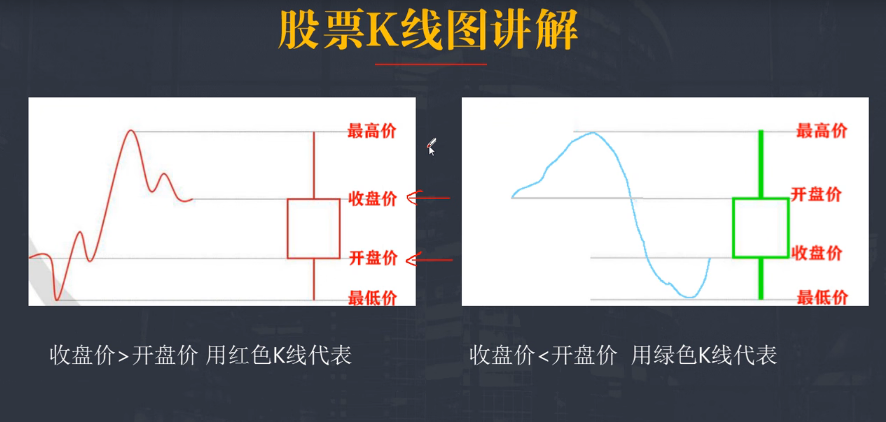

### k线图

### 趋势线

##### 定义

趋势线是在k线图上画的，
趋势线就是上涨行情中两个以上的低点的连线以及下跌行情中两个以上高点的连线，前者被称为上升趋势线，后者被称为下降趋势线。
上升趋势线的功能在于能够显示出股价上升的支撑位，一旦股价在波动过程中跌破此线，就意味着行情可能出现反转，由涨转跌；
下降趋势线的功能在于能够显示出股价下跌过程中回升的阻力，一旦股价在波动中向上突破此线，就意味着股价可能会止跌回涨

##### 作用

正确地划出趋势线，人们就可以大致了解股价的未来发展方向，
按所依据波动的时间长短不同，便出现三种趋势线：短期趋势线（连接各短期波动点）、中期趋势线（连接各中期波动点）、长期趋势线（连接各长期波动点）